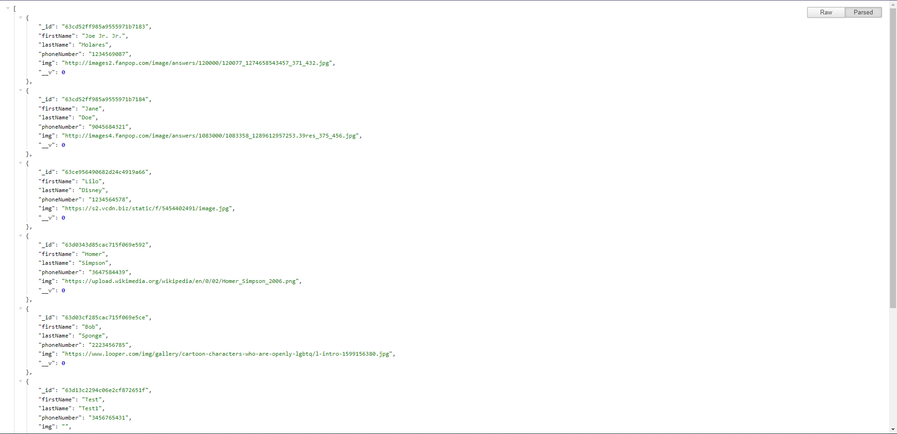
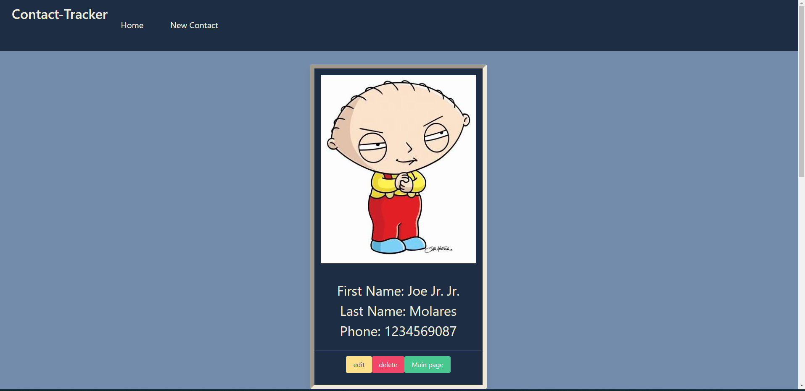

# Contacts Tracker (Frontend)
This full stack application keeps track of all your contacts' First and last names as well as their phone number and a desired image. 
This repo is the front-end of the application, which takes care of everything the user interacts with. It takes care of displaying the contacts list, showing the individual information for each contact, lets the user edit and add new information to the contact's form. 

## How the app looks from the server side.

## How the app looks from the frontend/UI.
Main page:

New contact page:

Contact information page:

Edit contact page:

## Technologies used
- Reactjs
- CSS 
- HTML
- Bulma as CSS framework
- React-dom
- React-dom-router
- Axios

## Getting Started
**Please keep in mind:** ==both front and back and are deployed on render using the free deployemnt option, so it might take a little to connect and load the information.==

[Server on render](https://contacts-tracker-backend.onrender.com/contacts)

[UI on render](https://contacts-tracker-frontend.onrender.com/)

### Fork and clone this repository:
1. Fork it.
2. Open your text editor of choice.
3. Open terminal and paste the line below.
`git clone https://github.com/OriCruz/contacts-tracker-frontend.git`
4. To start the repo in your local machine use `npm start` in project's directory

## Unsolved problems and Future Enhancements
**Some unsolved issues:**
- There is no default image to display if the url or link the user adds to contacts don't work. 
- Phone number is not formatted, so it looks like a string of numbers.

**Future enhancements:**
- User login/sinup page.
- User authentication.
- Add more CSS features.
- Display list of contacts for each user with their own data.
- Phone number formatting.
- Display list of contacts in alphabetical order.
- Display default image if the user's is link is broken.
